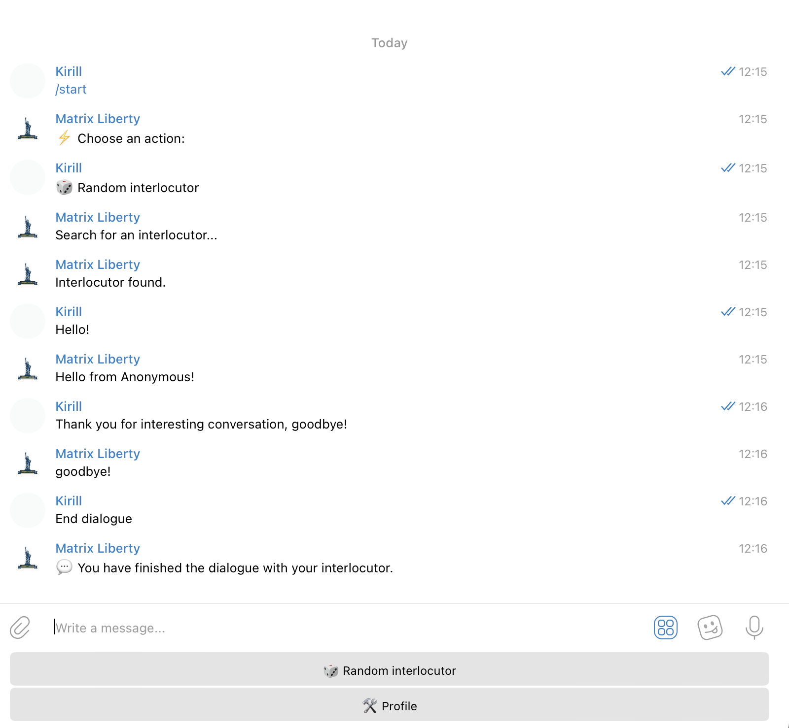

# anonymous-chat
anonymous chat in telegram using a bot

## Requirements
[docker](https://www.docker.com)

## Installation
1. Build image
```
docker build -t anonymous-chat ./
```
2. Run image
```
docker run --name anonymous-chat \
    -e BOT_TOKEN=<YOUR_TG_BOT_TOKEN> anonymous-chat (you can use -d flag to run the bot in a background process)
```

## Screenshots

